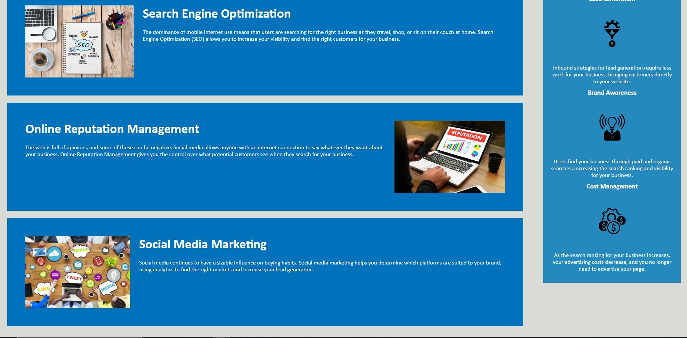
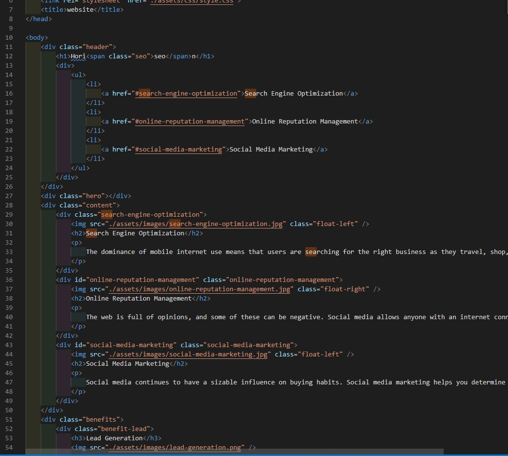
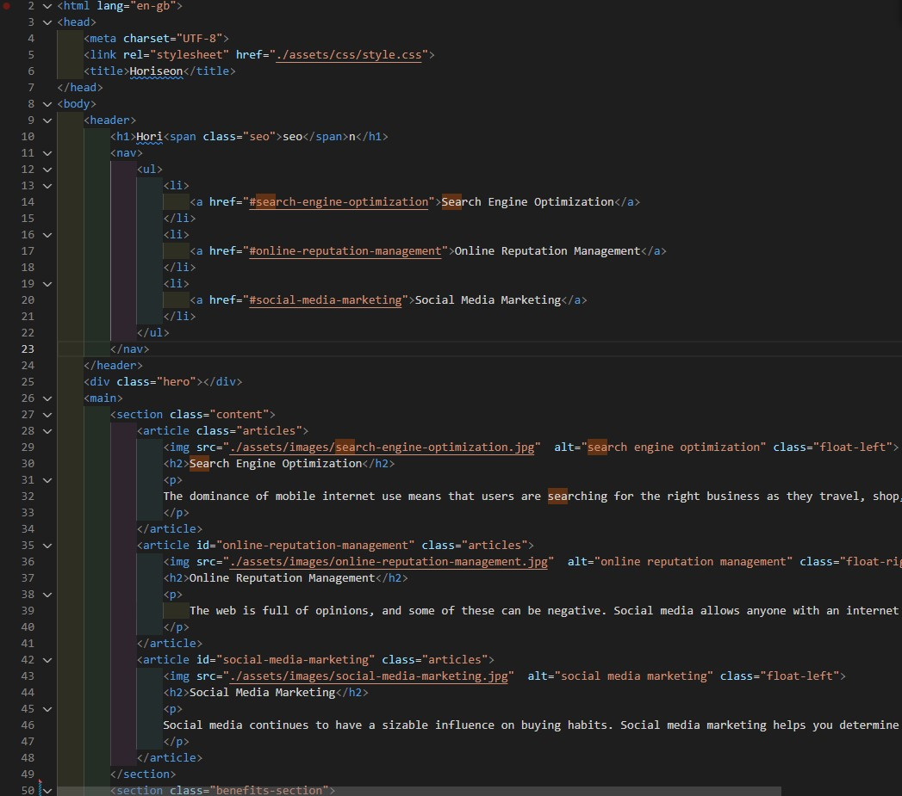
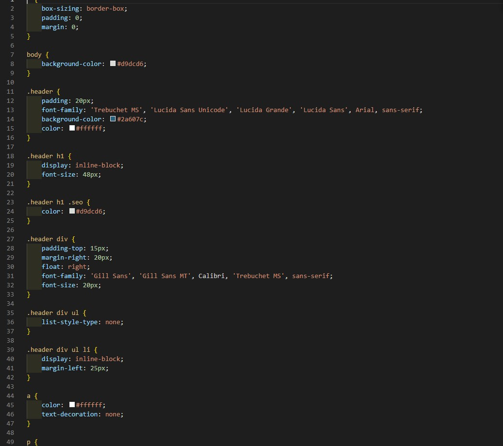
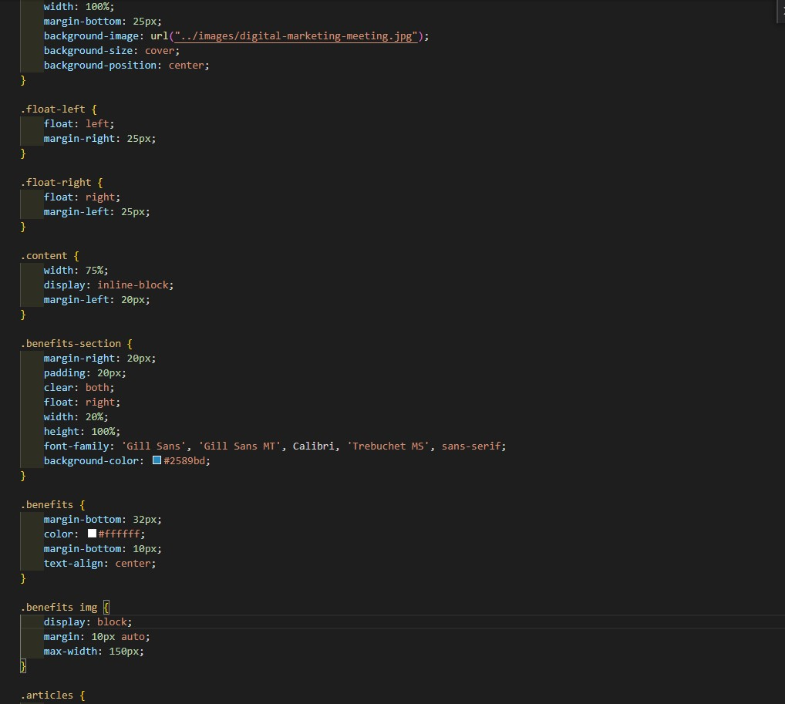

# 01 HTML CSS Git: Code Refactor

## My task is to refactor a HTML file using semantic html elements. 

Web accessibility is an increasingly important consideration for businesses. It ensures that people with disabilities can access a website using assistive technologies such as video captions, screen readers, and braille keyboards. Making a website accessible is also good for business for many reasons, one of them being that accessible sites are better positioned in search engines like Google. It also helps companies avoid litigation that can occur when people with disabilities cannot access their website.

## Site & Repo
* [Site](https://dj-86.github.io/bootcamp-challenge-week-1/starter/index.html)
* [Repo](https://github.com/DJ-86/bootcamp-challenge-week-1/tree/main/starter)

## Resources:

* [Semantic HTML](https://www.w3schools.com/html/html5_semantic_elements.asp)
* [Image `alt` attributes](https://www.w3schools.com/tags/att_img_alt.asp)

## Screenshots

## HTML
### Before
 
### After
 

## CSS
### Before
 
### After
 
